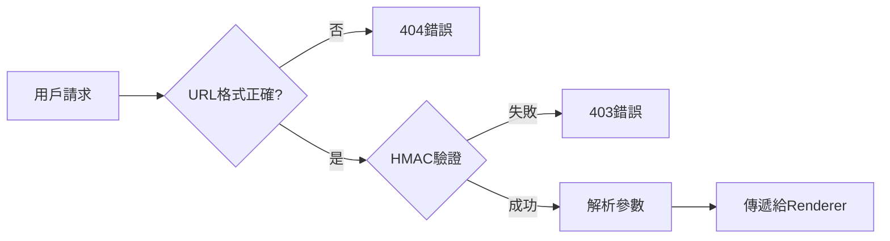
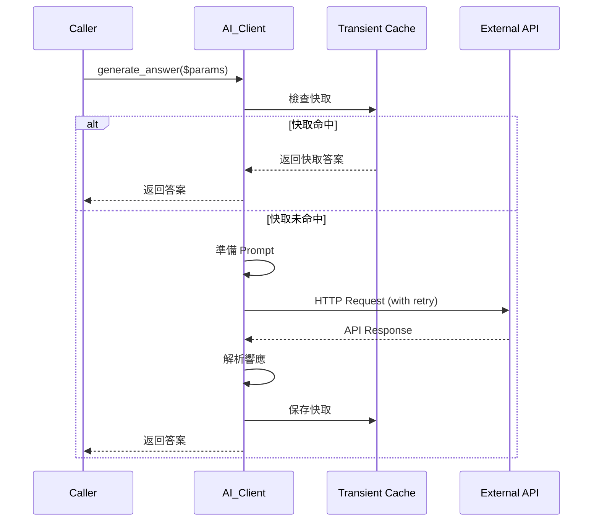
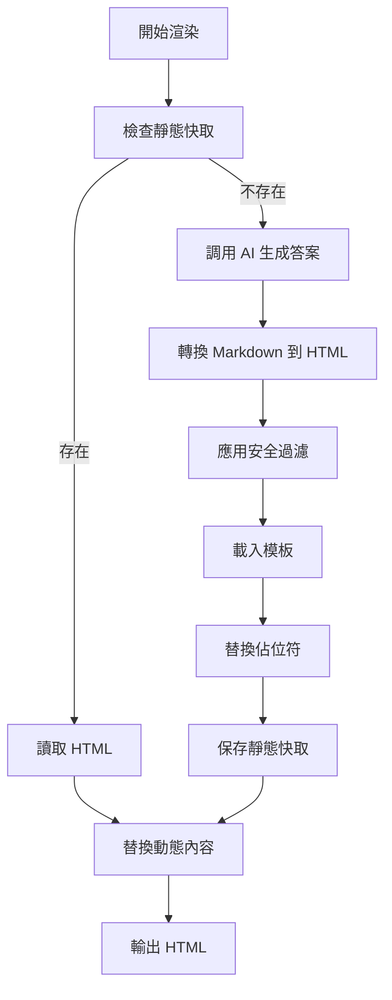
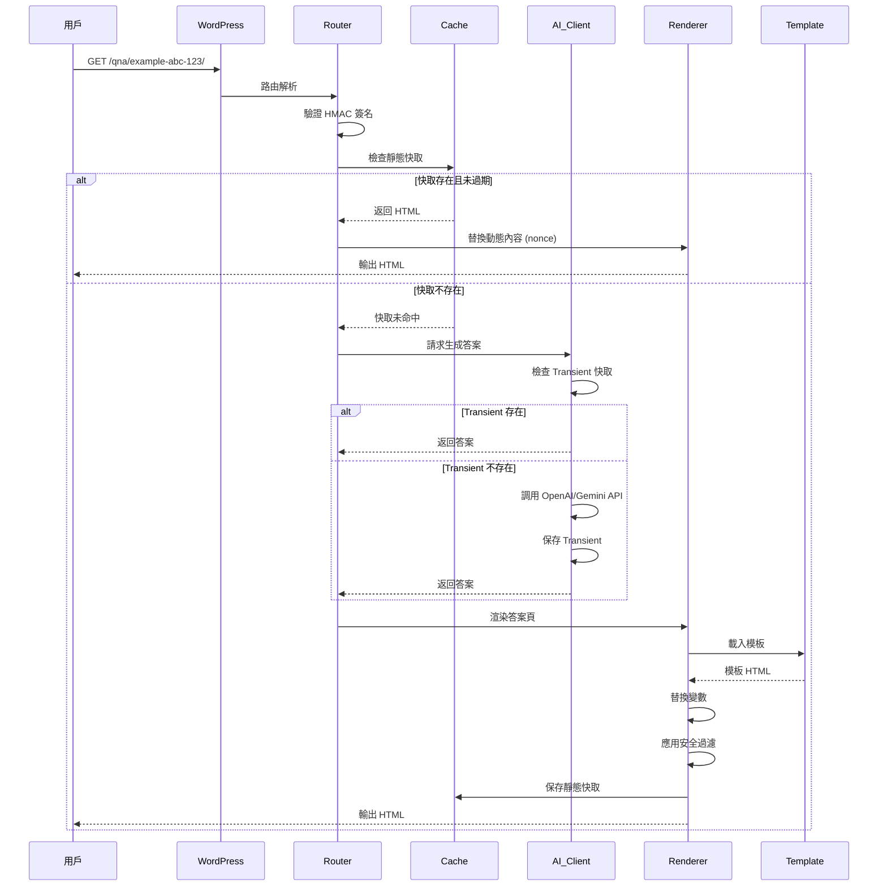

# 架構概覽

## 📐 整體架構

Moelog AI Q&A Links 採用模組化架構設計，遵循**單一職責原則**和**依賴注入**模式。

### 系統層次結構

```
┌─────────────────────────────────────────────────────────────┐
│                     WordPress Core                          │
└────────────────────────┬────────────────────────────────────┘
                         │
┌────────────────────────┴────────────────────────────────────┐
│                    Plugin Bootstrap                          │
│              (moelog-ai-qna.php)                            │
│  - 定義常數                                                   │
│  - 自動加載器                                                 │
│  - 初始化核心                                                 │
└────────────────────────┬────────────────────────────────────┘
                         │
┌────────────────────────┴────────────────────────────────────┐
│                  Core Coordinator                           │
│            (Moelog_AIQnA_Core)                              │
│  - 單例模式管理                                               │
│  - 模組初始化                                                 │
│  - 鉤子註冊                                                   │
└───┬────────┬─────────┬─────────┬─────────┬─────────┬───────┘
    │        │         │         │         │         │
    ▼        ▼         ▼         ▼         ▼         ▼
┌──────┐ ┌──────┐ ┌──────┐ ┌──────┐ ┌──────┐ ┌──────┐
│Router│ │  AI  │ │Cache │ │Render│ │Admin │ │Assets│
└──────┘ └──────┘ └──────┘ └──────┘ └──────┘ └──────┘
    │        │         │
    ▼        ▼         ▼
┌──────┐ ┌──────┐ ┌──────┐
│Feedbk│ │ GEO  │ │PreGen│
└──────┘ └──────┘ └──────┘
```

## 🧩 核心模組

### 1. Core (核心協調器)

**文件**: `includes/class-core.php`

**職責**:

- 管理插件生命週期
- 初始化所有子模組
- 註冊 WordPress 鉤子
- 提供單例存取點

**主要方法**:

```php
class Moelog_AIQnA_Core {
    // 單例實例
    private static $instance = null;

    // 模組實例
    private $router;
    private $ai_client;
    private $renderer;
    private $cache;
    private $admin;

    // 取得單例
    public static function get_instance();

    // 初始化依賴
    private function load_dependencies();

    // 註冊鉤子
    private function register_hooks();

    // 建立答案 URL
    public function build_answer_url($post_id, $question);
}
```

**設計模式**:

- **單例模式** (Singleton) - 確保只有一個核心實例
- **工廠模式** (Factory) - 創建和管理子模組

---

### 2. Router (路由處理器)

**文件**: `includes/class-router.php`

**職責**:

- 註冊自定義 URL 規則
- 解析請求參數
- 驗證 URL 簽名（HMAC）
- 分發請求到相應處理器

**URL 結構**:

```
https://example.com/qna/{slug}-{hash}-{id}/
                         └─┬─┘ └─┬─┘ └┬┘
                           │     │    └─ 文章 ID (Base36)
                           │     └────── HMAC 簽名 (3字符)
                           └──────────── URL 友好的 slug
```

**工作流程**:



**關鍵代碼**:

```php
class Moelog_AIQnA_Router {
    public function register_routes() {
        // 註冊 rewrite rule
        add_rewrite_rule(
            '^qna/([^/]+)/?$',
            'index.php?moe_ai=1&moe_slug=$matches[1]',
            'top'
        );
    }

    public function parse_request() {
        // 解析和驗證請求
        $slug = get_query_var('moe_slug');
        list($post_id, $hash, $question) = $this->parse_slug($slug);

        // HMAC 驗證
        if (!$this->verify_signature($post_id, $question, $hash)) {
            wp_die('Invalid URL', 403);
        }

        return compact('post_id', 'question');
    }
}
```

---

### 3. AI Client (AI 服務客戶端)

**文件**: `includes/class-ai-client.php`

**職責**:

- 管理多個 AI 提供商
- 處理 API 認證
- 實現重試機制
- 管理 API 快取

**支援的提供商**:

- OpenAI (GPT-4o-mini, GPT-4o 等)
- Google Gemini (Gemini 2.5 Flash/Pro 等)
- Anthropic Claude (Claude Opus, Sonnet 等)

**架構**:

```
┌─────────────────────────────────────┐
│         AI_Client (統一接口)         │
├─────────────────────────────────────┤
│  + generate_answer()                │
│  + test_connection()                │
│  + clear_cache()                    │
└────────┬────────────────────────────┘
         │
    ┌────┴────┬────────┬────────┐
    ▼         ▼        ▼        ▼
┌────────┐ ┌────────┐ ┌──────┐ ┌──────┐
│OpenAI  │ │Gemini  │ │Claude│ │Future│
│Handler │ │Handler │ │Handler│ │ ...  │
└────────┘ └────────┘ └──────┘ └──────┘
```

**請求流程**:



**重試機制**:

```php
private function request_with_retry($url, $args, $max_retries = 3) {
    $attempt = 0;

    while ($attempt < $max_retries) {
        $response = wp_remote_post($url, $args);

        if (!is_wp_error($response)) {
            return $response;
        }

        $attempt++;
        // 指數退避
        sleep(pow(2, $attempt));
    }

    return $response; // 最後一次嘗試的結果
}
```

---

### 4. Cache (快取管理器)

**文件**: `includes/class-cache.php`

**職責**:

- 管理雙層快取系統
- 處理快取過期
- 提供快取統計

**雙層快取架構**:

```
┌──────────────────────────────────────────────────┐
│              快取層級                              │
├──────────────────────────────────────────────────┤
│                                                  │
│  第一層: 靜態 HTML 文件                           │
│  ┌────────────────────────────────────────┐     │
│  │ wp-content/ai-answers/                 │     │
│  │  └─ {post_id}-{hash}.html              │     │
│  │                                        │     │
│  │ 優點: 極快的讀取速度                    │     │
│  │ 缺點: 需要文件系統訪問                  │     │
│  └────────────────────────────────────────┘     │
│                 ↕                                │
│  第二層: WordPress Transient                     │
│  ┌────────────────────────────────────────┐     │
│  │ wp_options 表                          │     │
│  │  option_name: _transient_moe_aiqna_... │     │
│  │  option_value: AI 生成的答案            │     │
│  │                                        │     │
│  │ 優點: 自動過期管理                      │     │
│  │ 支援: 對象快取（Redis/Memcached）       │     │
│  └────────────────────────────────────────┘     │
│                 ↕                                │
│  第三層: 物件快取 (Object Cache)                 │
│  ┌────────────────────────────────────────┐     │
│  │ wp_cache_get()                         │     │
│  │                                        │     │
│  │ 優點: 記憶體級別速度                    │     │
│  │ 適用: Meta Data, Post Objects          │     │
│  └────────────────────────────────────────┘     │
│                                                  │
└──────────────────────────────────────────────────┘
```

**快取鍵值生成**:

```php
private static function generate_hash($post_id, $question) {
    $secret = get_option(MOELOG_AIQNA_SECRET_KEY);
    $data = $post_id . '|' . $question;

    return substr(
        hash_hmac('sha256', $data, $secret),
        0,
        16
    );
}
```

**快取清除策略**:

```php
// 1. 手動清除
public static function delete($post_id, $question = null);

// 2. 自動清除（文章更新時）
add_action('save_post', function($post_id) {
    Moelog_AIQnA_Cache::clear_post_cache($post_id);
});

// 3. TTL 過期清除
public static function clear_expired();
```

---

### 5. Renderer (渲染引擎)

**文件**: `includes/class-renderer.php`

**職責**:

- 生成答案頁面 HTML
- 應用模板系統
- 注入安全相關標頭
- 處理 CSP nonce

**渲染流程**:



**模板系統**:

```php
// 模板優先級
1. {主題目錄}/moelog-ai-qna/answer-page.php
2. {插件目錄}/templates/answer-page.php (默認)

// 模板變數
$template_vars = [
    'question'     => $question,
    'answer'       => $answer_html,
    'post_id'      => $post_id,
    'post_title'   => get_the_title($post_id),
    'post_url'     => get_permalink($post_id),
    'nonce'        => wp_create_nonce('moelog_aiqna'),
    'settings'     => $settings,
];
```

**CSP 安全**:

```php
// 生成唯一 nonce
$nonce = wp_create_nonce('moelog_aiqna_csp_' . time());

// 設置 CSP 標頭
header(sprintf(
    "Content-Security-Policy: default-src 'self'; script-src 'nonce-%s'; style-src 'nonce-%s'",
    $nonce,
    $nonce
));

// 在 HTML 中使用
echo '<script nonce="' . esc_attr($nonce) . '">...</script>';
```

---

### 6. Admin (後台管理)

**文件**: `includes/class-admin.php`, `includes/class-admin-settings.php`

**職責**:

- 設定頁面渲染
- 選項驗證和保存
- 管理界面 AJAX 處理
- 系統狀態監控

**設定頁面結構**:

```
┌─────────────────────────────────────┐
│        設定 → Moelog AI Q&A         │
├─────────────────────────────────────┤
│ 📑 分頁導航                          │
│ [一般] [顯示] [快取設定] [系統資訊]  │
├─────────────────────────────────────┤
│                                     │
│  一般設定:                           │
│  ├─ AI 供應商選擇                    │
│  ├─ API 金鑰 (加密存儲)              │
│  ├─ 模型選擇                         │
│  └─ Temperature 設定                │
│                                     │
│  內容設定:                           │
│  ├─ 包含文章內容                     │
│  ├─ 內容截斷長度                     │
│  └─ System Prompt                  │
│                                     │
│  顯示設定:                           │
│  ├─ 問題清單標題                     │
│  ├─ 免責聲明                         │
│  └─ STM 模式                        │
│                                     │
└─────────────────────────────────────┘
```

---

### 7. Metabox (文章編輯器)

**文件**: `includes/class-metabox.php`

**職責**:

- 在文章編輯頁顯示問題管理界面
- 支援拖曳排序
- 即時預覽
- AJAX 保存

**界面結構**:

```
┌─────────────────────────────────────┐
│    AI 問題清單管理                   │
├─────────────────────────────────────┤
│ 問題 1:                              │
│ ┌─────────────────────────────────┐ │
│ │ 這篇文章的主要重點是什麼？        │ │
│ └─────────────────────────────────┘ │
│ [🔧 預覽] [🗑️ 刪除] [⬍ 拖曳]        │
├─────────────────────────────────────┤
│ 問題 2: ...                         │
├─────────────────────────────────────┤
│ [➕ 新增問題]                        │
│ [🔄 重新生成全部] [🗑️ 清除快取]     │
└─────────────────────────────────────┘
```

**拖曳排序實現**:

```javascript
jQuery(".moelog-aiqna-questions-list").sortable({
  handle: ".drag-handle",
  update: function (event, ui) {
    // 更新問題順序
    updateQuestionOrder();
  },
});
```

---

### 8. Feedback (反饋系統)

**文件**: `includes/class-feedback-controller.php`

**職責**:

- 記錄使用者對答案的評價（👍/👎）
- 防止重複評價（基於 Cookie/IP）
- 提供統計數據 API

**數據存儲**:

- **Meta Key**: `_moelog_aiqna_feedback_stats_{hash}`
- **格式**: `['likes' => 10, 'dislikes' => 2]`

---

### 9. GEO/STM (結構化資料模式) - _可選_

**文件**: `moelog-ai-geo.php`

> **命名說明**: 模組原名 GEO，現已更名為 STM (Structured Data Mode)，但檔案名稱保持不變以維護向後相容性。

**職責**:

- 注入 Schema.org 結構化資料 (QAPage, BreadcrumbList)
- 輸出 SEO Meta 標籤 (OG, Twitter Card)
- 產生 AI 問答專用 Sitemap
- 設定 CDN 友善的 HTTP 快取標頭
- 管理搜尋引擎爬蟲白名單

**工作原理**:

1. 在答案頁 `<head>` 注入 JSON-LD 結構化資料
2. 設定 `index,follow` robots 標籤（取代預設 `noindex`）
3. 產生 Sitemap index + 分頁（最多 49,000 URL/頁）
4. 回應條件式請求（304 Not Modified）

**詳細說明**: 請參閱 [stm-mode.md](stm-mode.md)

---

## 🔐 安全架構

### 1. API 金鑰加密

```
明文 API Key
     │
     ▼
┌──────────────────────┐
│  AES-256-CBC 加密     │
│  + WordPress Salts   │
│  + 隨機 IV           │
└──────────┬───────────┘
           │
           ▼
     加密後的字串
     (存儲在資料庫)
```

**實現**:

```php
// 加密
function moelog_aiqna_encrypt_api_key($plain_key) {
    $key = hash('sha256', wp_salt('auth'));
    $iv = openssl_random_pseudo_bytes(16);

    $encrypted = openssl_encrypt(
        $plain_key,
        'AES-256-CBC',
        $key,
        0,
        $iv
    );

    return base64_encode($iv . $encrypted);
}

// 解密
function moelog_aiqna_decrypt_api_key($encrypted_key) {
    $data = base64_decode($encrypted_key);
    $iv = substr($data, 0, 16);
    $encrypted = substr($data, 16);
    $key = hash('sha256', wp_salt('auth'));

    return openssl_decrypt(
        $encrypted,
        'AES-256-CBC',
        $key,
        0,
        $iv
    );
}
```

### 2. HMAC URL 簽名

防止 URL 被猜測或篡改：

```php
function generate_url_signature($post_id, $question) {
    $secret = get_option(MOELOG_AIQNA_SECRET_KEY);
    $data = $post_id . '|' . $question;

    return substr(
        hash_hmac('sha256', $data, $secret),
        0,
        3  // 取前3個字符
    );
}
```

### 3. 內容安全策略 (CSP)

```http
Content-Security-Policy:
    default-src 'self';
    script-src 'nonce-{RANDOM}';
    style-src 'nonce-{RANDOM}';
    img-src 'self' data:;
    font-src 'self';
    connect-src 'self';
    frame-ancestors 'none';
```

---

## 📊 數據流示例

### 完整的答案生成流程



---

## 🔧 擴展點

插件提供多個擴展點供開發者自定義：

### Hooks (動作鉤子)

```php
// 在生成答案之前
do_action('moelog_aiqna_before_generate', $post_id, $question);

// 在生成答案之後
do_action('moelog_aiqna_after_generate', $post_id, $question, $answer);

// 在清除快取時
do_action('moelog_aiqna_cache_cleared', $post_id);

// 在渲染答案頁之前
do_action('moelog_aiqna_before_render', $post_id, $question);
```

### Filters (過濾器鉤子)

```php
// 修改 AI 請求參數
apply_filters('moelog_aiqna_ai_params', $params, $post_id);

// 修改生成的答案
apply_filters('moelog_aiqna_answer', $answer, $post_id, $question);

// 修改渲染的 HTML
apply_filters('moelog_aiqna_render_html', $html, $post_id, $question);

// 修改快取 TTL
apply_filters('moelog_aiqna_cache_ttl', $ttl);

// 自定義模板路徑
apply_filters('moelog_aiqna_template_path', $path, $template_name);
```

詳細用法請參閱 [Hooks & Filters 文檔](hooks-filters.md)。

---

## 🎯 設計原則

### 1. 單一職責原則 (SRP)

每個類別只負責一個功能領域。

### 2. 開閉原則 (OCP)

對擴展開放，對修改封閉。通過 hooks 和 filters 實現。

### 3. 依賴倒置原則 (DIP)

高層模組不依賴低層模組，都依賴於抽象。

### 4. 最小知識原則

模組之間保持鬆耦合，通過明確的接口通訊。

---

## 📚 相關文檔

- [公共 API 參考](api-reference.md)
- [Hooks & Filters](hooks-filters.md)
- [數據流詳解](data-flow.md)

---

最後更新：2025-11-28
