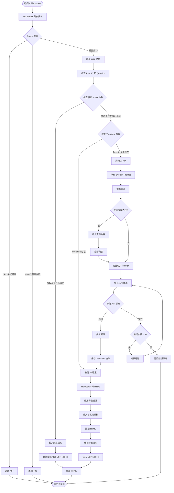
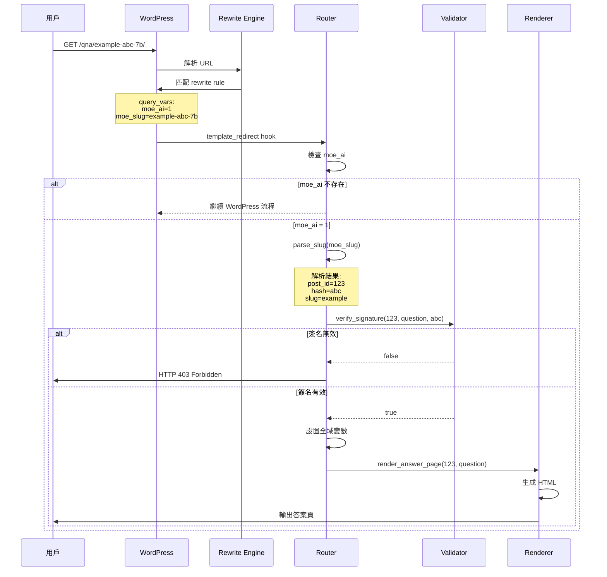
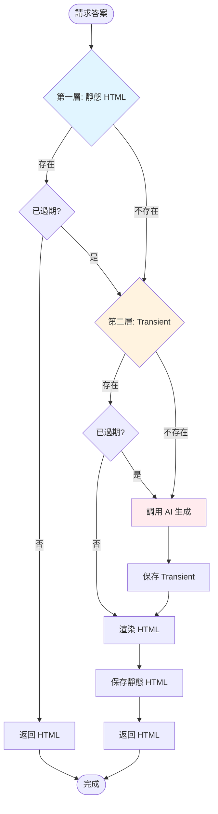
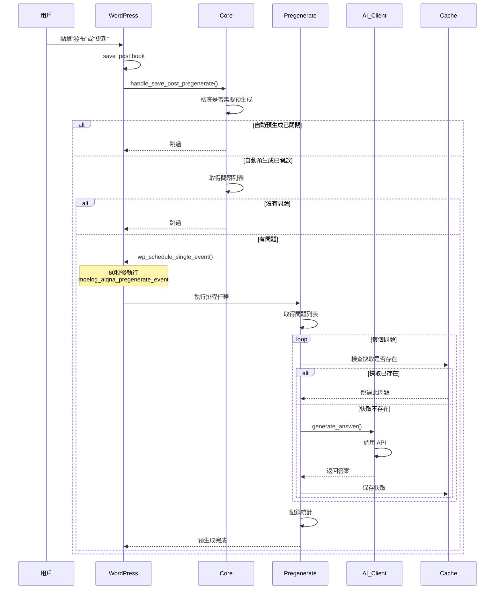
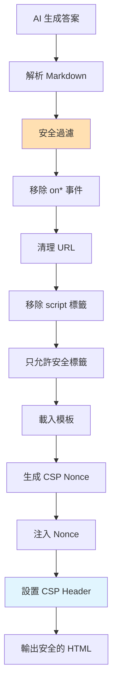
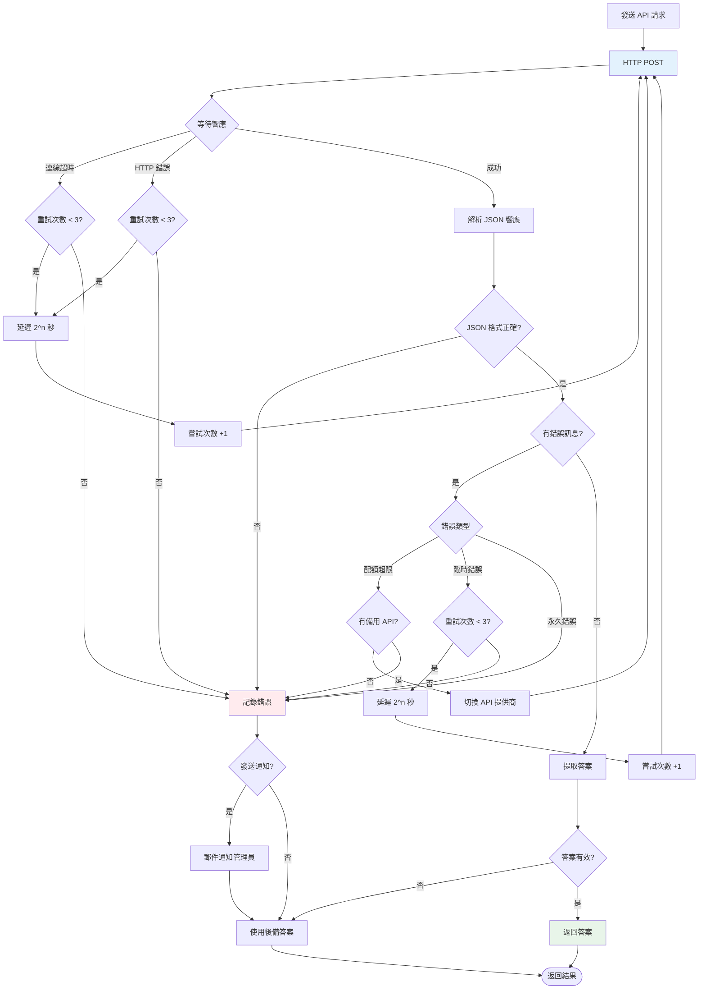
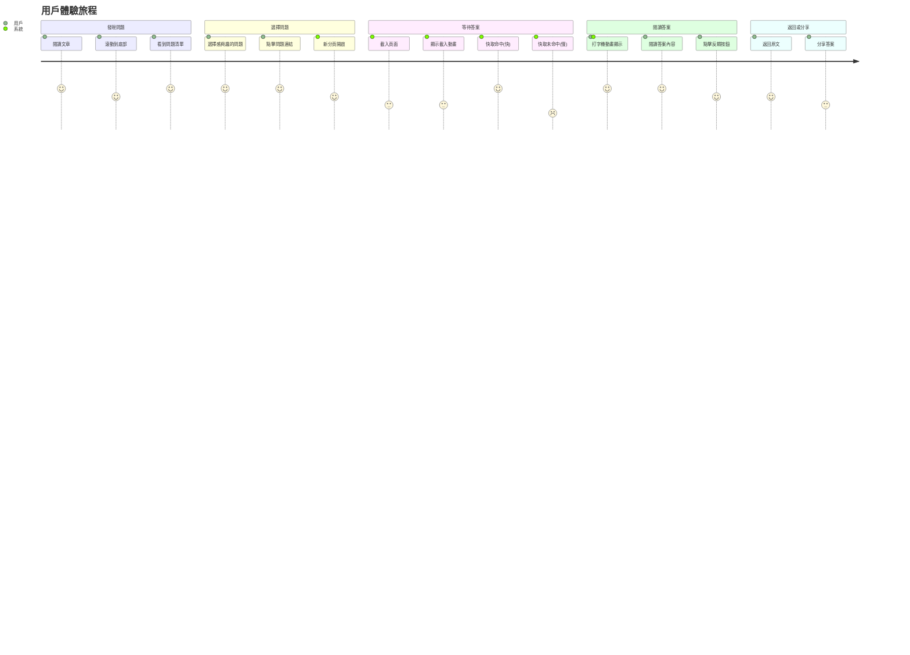
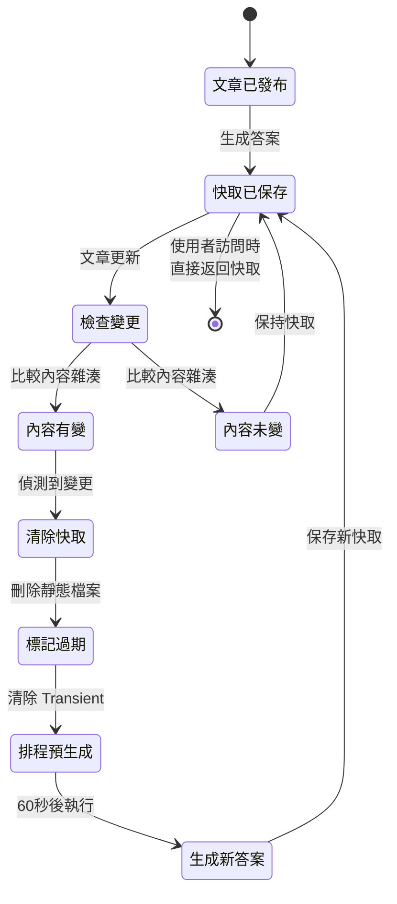
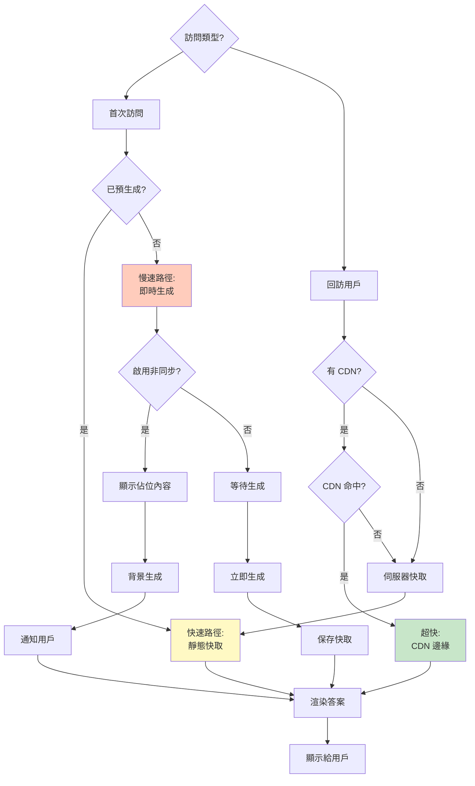
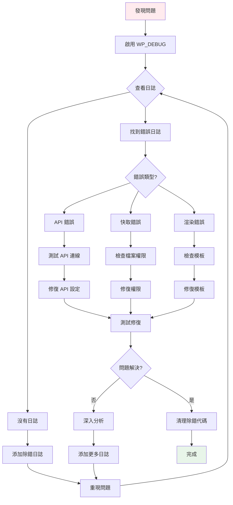

# 數據流與流程圖

本文檔使用圖表詳細說明插件中的數據流動和業務流程。

## 📋 目錄

- [完整答案生成流程](#完整答案生成流程)
- [路由處理流程](#路由處理流程)
- [快取策略流程](#快取策略流程)
- [預生成流程](#預生成流程)
- [安全驗證流程](#安全驗證流程)
- [錯誤處理流程](#錯誤處理流程)

---

## 🔄 完整答案生成流程

這是從用戶訪問答案頁到顯示內容的完整流程。



---

## 🛤️ 路由處理流程

WordPress 如何將 URL 路由到插件處理器。



---

## 💾 快取策略流程

雙層快取系統如何運作。



**快取層級說明**:

| 層級 | 類型                | 速度        | TTL            | 適用場景                 |
| ---- | ------------------- | ----------- | -------------- | ------------------------ |
| L1   | 靜態 HTML 檔案      | ⚡⚡⚡ 極快 | 30 天 (可設定) | 完整答案頁               |
| L2   | WordPress Transient | ⚡⚡ 快     | 24 小時        | AI 生成的答案 (Markdown) |
| L0   | 對象快取 (可選)     | ⚡⚡⚡ 極快 | 視伺服器設定   | Redis/Memcached          |

---

## 🔄 預生成流程

文章發布或更新時自動預生成答案。



**預生成觸發條件**:

```php
// 1. 文章發布
add_action('publish_post', 'trigger_pregenerate');

// 2. 文章更新 (內容有變化)
add_action('post_updated', 'trigger_pregenerate_on_content_change');

// 3. 問題列表變更
add_action('moelog_aiqna_metabox_saved', 'trigger_pregenerate');

// 4. 手動觸發 (後台按鈕)
add_action('wp_ajax_moelog_aiqna_pregenerate', 'manual_pregenerate');
```

---

## 🔒 安全驗證流程

URL 簽名驗證和內容安全處理。

### HMAC URL 簽名驗證

```mermaid
graph LR
    A[生成 URL] --> B[計算 HMAC]
    B --> C[取得 Secret Key]
    C --> D[組合數據:<br/>post_id | question]
    D --> E[HMAC-SHA256]
    E --> F[取前 3 個字符]
    F --> G[附加到 URL]

    H[用戶訪問] --> I[解析 URL]
    I --> J[提取參數]
    J --> K[重新計算 HMAC]
    K --> L{HMAC 匹配?}
    L -->|是| M[允許訪問]
    L -->|否| N[返回 403]

    style A fill:#e8f5e9
    style H fill:#fff3e0
    style N fill:#ffebee
```

**程式碼實現**:

```php
// 生成簽名
function generate_signature($post_id, $question) {
    $secret = get_option(MOELOG_AIQNA_SECRET_KEY);
    $data = $post_id . '|' . $question;
    $hash = hash_hmac('sha256', $data, $secret);
    return substr($hash, 0, 3);
}

// 驗證簽名
function verify_signature($post_id, $question, $provided_hash) {
    $expected_hash = generate_signature($post_id, $question);
    return hash_equals($expected_hash, $provided_hash);
}
```

### 內容安全策略 (CSP)



**允許的 HTML 標籤**:

```php
$allowed_tags = [
    'h1', 'h2', 'h3', 'h4', 'h5', 'h6',
    'p', 'br', 'strong', 'em', 'u', 'del',
    'ul', 'ol', 'li',
    'blockquote', 'pre', 'code',
    'a' => ['href', 'title'],
    'img' => ['src', 'alt', 'title'],
    'table', 'thead', 'tbody', 'tr', 'th', 'td',
];
```

---

## ❌ 錯誤處理流程

API 調用失敗時的重試機制。



**重試策略**:

| 嘗試次數 | 延遲時間 | 說明                  |
| -------- | -------- | --------------------- |
| 1        | 0 秒     | 立即嘗試              |
| 2        | 2 秒     | 2^1 = 2 秒            |
| 3        | 4 秒     | 2^2 = 4 秒            |
| 4        | 8 秒     | 2^3 = 8 秒 (最後一次) |

**錯誤分類**:

```php
// 1. 臨時錯誤 (可重試)
$temporary_errors = [
    'rate_limit_exceeded',  // 速率限制
    'timeout',              // 超時
    'server_error',         // 伺服器錯誤 (5xx)
];

// 2. 永久錯誤 (不可重試)
$permanent_errors = [
    'invalid_api_key',      // API 金鑰無效
    'model_not_found',      // 模型不存在
    'invalid_request',      // 請求格式錯誤
];

// 3. 配額錯誤 (可切換提供商)
$quota_errors = [
    'quota_exceeded',       // 配額超限
    'insufficient_quota',   // 配額不足
];
```

---

## 📊 用戶互動流程

從用戶點擊問題到查看答案的完整體驗。



---

## 🔄 快取失效與更新流程

當文章內容變更時如何處理快取。



**內容雜湊計算**:

```php
function calculate_content_hash($post_id) {
    $post = get_post($post_id);
    $questions = get_post_meta($post_id, '_moelog_aiqna_questions', true);

    $data = implode('|', [
        $post->post_content,
        $post->post_title,
        $post->post_modified,
        serialize($questions),
    ]);

    return hash('sha256', $data);
}
```

---

## 📈 性能優化決策樹

根據不同場景選擇最佳策略。



---

## 🔍 除錯流程

開發者如何追蹤和除錯問題。



**除錯檢查清單**:

```php
// 1. 啟用除錯模式
define('WP_DEBUG', true);
define('WP_DEBUG_LOG', true);
define('WP_DEBUG_DISPLAY', false);

// 2. 檢查錯誤日誌
tail -f wp-content/debug.log

// 3. 測試 API 連線
$ai_client = Moelog_AIQnA_Core::get_instance()->get_ai_client();
$result = $ai_client->test_connection('openai', 'your-api-key');

// 4. 檢查快取權限
ls -la wp-content/ai-answers/

// 5. 驗證 URL 簽名
$url = moelog_aiqna_build_url(123, '測試問題');
// 訪問 URL 並檢查是否正常
```

---

## 📚 相關文檔

- [架構概覽](architecture.md) - 系統整體架構
- [API 參考](api-reference.md) - 詳細 API 文檔
- [Hooks & Filters](hooks-filters.md) - 擴展點詳解

---

最後更新：2025-11-28
